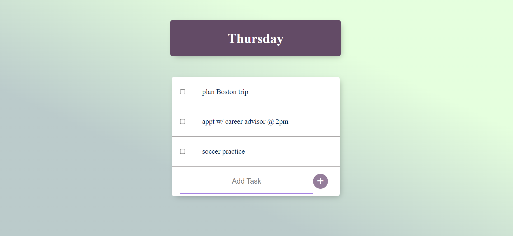

# ToDoList
A simple To-Do List web application with a Node/Express back end, connected to MongoDB Atlas using Mongoose. This application allows users to create multiple to-do lists and stores the to-do tasks in databases.
<br><br>

<br><br>
## Installation & Set Up
### Install Node.js
* Download the Mac/Window installer from the Nodes.js® web site.
* Choose the LTS version that’s shown on the left
* Run the installer (double-click on the .pkg (for Mac) or .msi (for Window) file you downloaded in the previous step.)
* Follow the prompts in the installer (Accept the license agreement, click the NEXT button a bunch of times and accept the default installation settings).
* Confirm that node has been installed successfully. You should see the version of node you have just installed.
```
node --version
```
## Running the App
In your terminal, cd to the folder directory and run: 
```
node app.js
```


